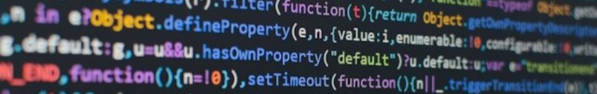

# Welcome to My GitHub

## About Me

My name is Henry Breukelman. I am currently taking software development at Manitoba Institute of 
Trades and Technology, and have learned the basics of HTML, CSS and JavaScript. I am looking 
forword to learning more languages and improving the ones I knowI want to get into app design 
or making games. 

I enjoy designing and crating things whether it is with Lego, Minecraft or code. I live in 
Roseisle Manitoba which is about an hour from Winnipeg. I enjoy reading, playing Minecraft
and building things

## Skills

&nbsp;
&nbsp;
&nbsp;

## Contact

Email: [henrybreukelman@student.mitt.ca](<mailto:henrybreukelman@student.mitt.ca>)

## Statistics

